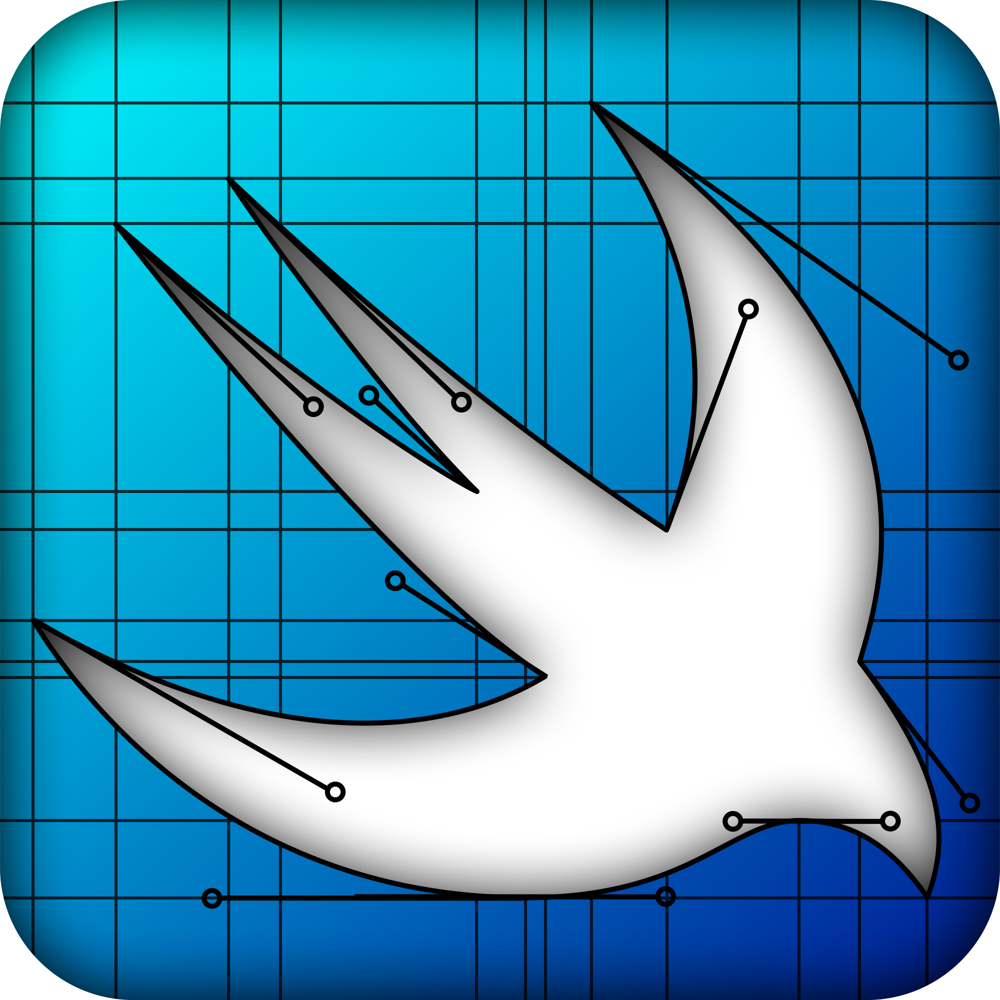
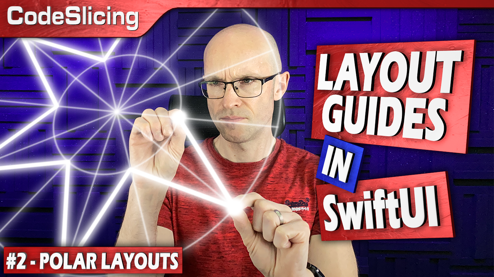

<p align="center">
<a href="https://github.com/CodeSlicing/pure-swift-ui-design">

</a>
</p>

[PureSwiftUIDesign][pure-swift-ui-design] is a Swift package that brings joy to the process of creating designs using paths in [SwiftUI][swift-ui] code. 

- [Motivation](#motivation)
- [Layout Guides](#layout-guides)
- [Extensions](#extensions)
- [Caveats](#caveats)
- [Installation](#installation)
- [Versioning](#versioning)
- [Version History](#version-history)
- [Licensing](#licensing)
- [Contact](#contact)

## Motivation

Creating paths in [SwiftUI][swift-ui] can be a bit of a pain. This is largely due to the calculation and creation of points that litter the resulting code not only making complex designs lengthy to write, but next to impossible to decode what's actually going on when you're reading it.

[PureSwiftUIDesign][pure-swift-ui-design] allows you to create incredibly complex and even animated designs quickly, while keeping the code simple.

It is my hope that the ease with which you can construct shapes using [PureSwiftUIDesign][pure-swift-ui-design]'s layout guides and `Path` extensions will encourage people to explore their artistic capabilities with constructing paths rather than be turned off by the ubiquitous point calculation logic that appears in most path building example code. Without these hurdles, you really are limited only by you imagination.

There are two main aspects to the package: [layout Guides][docs-layout-guides] and a multitude of extensions all designed to support the act of drawing shapes.

## Layout Guides

[Layout Guides][docs-layout-guides] offer a new way to draw shapes in SwiftUI. In short, they completely remove the need to calculate points, thereby avoiding the tortuous and lengthy process of declaring them throughout your path drawing code. 

In fact, the original logo for [PureSwiftUIDesign][pure-swift-ui-design] was created using layout guides, including the visibility of the control points in the curves used in the design, the gist of which can be found [here][gist-pure-swift-ui-design-logo].

For something a bit similar, consider the following code that draws six pointed star:

```swift
struct StarShapeNative: Shape {
    func path(in rect: CGRect) -> Path {
        Path { path in
            let numSegments = 12
            let outerRadius = min(rect.height, rect.width) / 2
            let innerRadius = outerRadius * innerRadiusRatio
            let center = CGPoint(x: rect.midX, y: rect.midY)
            let stepAngle = 2 * .pi / CGFloat(numSegments)
            
            path.move(to: CGPoint(x: rect.midX, y: rect.minY))
            
            for index in 0..<numSegments {
                
                let angle = CGFloat(index) * stepAngle
                let radius = index.isMultiple(of: 2) ? outerRadius : innerRadius
                let xOffset = radius * sin(angle)
                let yOffset = radius * cos(angle)
                
                path.addLine(to: CGPoint(x: center.x + xOffset, y: center.y - yOffset))
            }
            path.closeSubpath()
        }
    }
}
```
Note the verbosity on display in that code, including the usage of trigonometry to calculate the points. The point calculation really gets in the way of understanding what's being created meaning it's difficult to reason about the code. 

Contrast this with creating the same star using [layout guides][docs-layout-guides]:

```swift
private let starLayoutConfig = LayoutGuideConfig.polar(rings: [innerRadiusRatio, 1], segments: 12)

struct StarShape: Shape {
    
    func path(in rect: CGRect) -> Path {
        Path { path in
            let g = starLayoutConfig.layout(in: rect)
            
            path.move(g[1, 0]) // move to polar coordinate [1, 0] denoting the ring and segment
            
            for segment in 1..<g.yCount {
                // draw a line to the coordinate of the outer ring if the segment is even, otherwise go to the inner ring
                path.line(g[segment.isOdd ? 0 : 1, segment])
            }
            path.closeSubpath()
        }
    }
}
```
The takeaway is that we are declaratively saying *what* we want to do, not *how* to do it. We don't care about the location of the points themselves, we just ask for the point at a particular coordinate and let the framework sort it out. No trignometry is required and therefore we don't have any calculations cluttering up the intent of the code. 

For a detailed explanation of the differences and advantages, please watch this video where I cover creating that star using polar [layout guides][docs-layout-guides]:

<p align="center">
<a href="https://youtu.be/5gqjr0d62cU" target="_blank"></a>
</p>

There is a whole lot more to [layout guides][docs-layout-guides], including the ability to transform and animate the guides themselves. Anything you can imagine, you can do with ease using these constructs. Read the [documentation][docs-layout-guides] for all the details.

## Extensions

[PureSwiftUIDesign][pure-swift-ui-design] includes a multitude of extensions to make the process of creating paths a succinct and enjoyable one. Once you explore all that this framework has to offer, shape construction becomes more like building something out of lego. 

Read about all the available extensions and utilities [here][docs-extensions].

## Caveats

[PureSwiftUIDesign][pure-swift-ui-design] defines angles as starting from the trailing edge (as per native SwiftUI) and increasing in a clockwise direction. [Layout guides][docs-layout-guides] on the other hand, specifically of type polar, define the starting angle, by default, at the top. This makes sense for polar design work since if there is a reflective symmetry to the design, it is more likely to be on the vertical axis. Also, designs are easier to reason about if the angle starts from the top. You can override this behaviour by setting `fromTop` to `false` like so:

```swift
let layoutConfig = LayoutGuideConfig.polar(rings: 2, segments: 8, fromTop: false)
```

Be warned, however. The predefined constants in `Angle` such as `leading` and `trailing` are defined as per the native SwiftUI way of doing things. So if you want to specify angles like this: 

```swift
let layoutConfig = LayoutGuideConfig.polar(rings: 2, segments: [.trailing, .bottom, .leading], fromTop: false)
```
you *must* remember to set `fromTop` to `false` or the resulting angles will be offset 90 degrees anti-clockwise. 

## Installation

The `pure-swift-ui-design` package can be found at:

<https://github.com/CodeSlicing/pure-swift-ui-design.git>

Instructions for installing swift packages can be found [here][swift-package-installation].

## Versioning

This project adheres to a [semantic versioning](https://semver.org) paradigm, so breaking changes will be reserved for major version updates. 

## Version History

- [1.0.0][tag-1.0.0] Commit initial code

## Licensing

This project is licensed under the MIT License - see [here][mit-licence] for details.

## Contact

You can contact me on Twitter [@CodeSlice][codeslice-twitter]. Happy to hear suggestions for improving the package, mistakes I've made, or feature requests. I won't be open-sourcing the project at this time since I don't have time to administer PRs, I'm afraid.

<!---
 external links:
--->

[pure-swift-ui-design]: https://github.com/CodeSlicing/pure-swift-ui-design
[codeslice-twitter]: https://twitter.com/CodeSlice
[swift-ui]: https://developer.apple.com/xcode/swiftui/
[swift-functions]: https://docs.swift.org/swift-book/LanguageGuide/Functions.html
[swift-package-installation]: https://developer.apple.com/documentation/swift_packages/adding_package_dependencies_to_your_app

<!---
gists:
--->

[gist-pure-swift-ui-design-logo]: https://gist.github.com/CodeSlicing/7865ea405cd23f6ef538ddeefaac8da3

<!---
version links:
--->

[tag-1.0.0]: https://github.com/CodeSlicing/pure-swift-ui-design/tree/1.0.0


<!---
 local docs:
--->

[docs-layout-guides]: ./Assets/Docs/LayoutGuides/layout-guides.md
[docs-extensions]: ./Assets/Docs/Extensions/extensions.md
[mit-licence]: ./Assets/Docs/LICENCE.md
