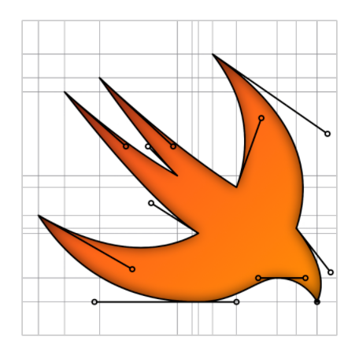

<p align="center">
<a href="https://github.com/CodeSlicing/pure-swift-ui-design.png">

</a>
</p>

[PureSwiftUIDesign][pure-swift-ui-design] is a Swift package that brings joy to the world of creating designs using paths in [SwiftUI][swift-ui] code. 

- [Motivation](#motivation)
- [TL;DR](#tldr)
- [Layout Guides](#layout-guides)
- [Path Extensions](#path-extensions)
- [Caveats](#caveats)
- [Installation](#installation)
- [Versioning](#versioning)
- [Version History](#version-history)
- [Licensing](#licensing)
- [Contact](#contact)

## Motivation

Creating paths in [SwiftUI][swift-ui] can be a bit of a pain. And the more complex the design, the more that pain increases. This is largly due to the creation of points that litter the resulting code not only making it lengthy to write, but next to impossible to decode what's actually going on when you're reading it. 

[PureSwiftUIDesign][pure-swift-ui-design] is here to help. It allows you to create incredibly complex and even animated designs quickly, while keeping the code simple and easy to understand. 

It is my hope that the ease with which you can construct shapes using [PureSwiftUIDesign][pure-swift-ui-design]'s layout guides and `Path` extensions will encourage people to explore their artistic capabilities with constructing paths rather than be turned off by the ubiquitous point calculation logic that appears in most path building example code. Without these hurdles, you really are limited only by you imagination.

## TL;DR

To demonstrate some of the advantages, let's say you want to generate the following label:

<p align="center">

</p>

The code below shows how you would generate this label, including a small offset, comparing the native `SwiftUI` code to that of [PureSwiftUI][pure-swift-ui].

```swift
//...

private let width: CGFloat = 200
private let height: CGFloat = 100
private let xOffset: CGFloat = 10
private let yOffset: CGFloat = 10
private let rotation: CGFloat = 20
private let scale: CGFloat = 1.1
private let opacity: Double = 0.9

//...

// native SwiftUI

Text("PureSwiftUI")
    .font(Font.title.bold())
    .foregroundColor(.white)
    .frame(width: width, height: height)
    .background(Color.red)
    .clipShape(Capsule())
    .overlay(Capsule().stroke(Color.black, lineWidth: 4))
    .rotationEffect(.degrees(rotation))
    .offset(x: xOffset, y: yOffset)
    .scaleEffect(scale)
    .opacity(opacity)

// with PureSwiftUI

TitleText("PureSwiftUI", .white, .bold)
    .frame(width, height)
    .clipCapsuleWithStroke(.black, lineWidth: 4, fill: Color.red)
    .rotate(rotation.degrees)
    .offset(xOffset, yOffset)
    .scale(scale)
    .opacity(opacity)
```

As you can see the difference is dramatic, favouring design over implementation boiler-plate. 

## Layout Guides

Layout Guides offer a new way to draw shapes in SwiftUI. In short, they completely remove the need to calculate points, thereby avoiding the tortuous and lengthy process of declaring them throughout your path drawing code. 

XXXX Quick example of usage

## Path Extensions

[PureSwiftUIDesign][pure-swift-ui-design] includes a multitude of extensions to make the process of creating paths a succinct and enjoyable one. 

XXXX Quick example of usage

## Layout Guides and Paths

[PureSwiftUI-design][pure-swift-ui-design] includes a multitude of extensions and utilities for making drawing paths a breeze. See the guide on [paths][docs-paths] for a detailed explanation of the various available extensions to facilitate drawing, and the section on [layout guides][docs-layout-guides] which take the process of shape building to the next level.

## Caveats

## Installation

The `pure-swift-ui-design` package can be found at:

<https://github.com/CodeSlicing/pure-swift-ui-design.git>

Instructions for installing swift packages can be found [here][swift-package-installation].

## Versioning

This project adheres to a [semantic versioning](https://semver.org) paradigm, so breaking changes will be reserved for major version updates. 

## Version History

- [1.0.0][tag-1.0.0] Commit initial code

## Licensing

This project is licensed under the MIT License - see [here][mit-licence] for details.

## Contact

You can contact me on Twitter [@CodeSlice][codeslice-twitter]. Happy to hear suggestions for improving the package, or feature requests. I've probably made a few boo boos along the way, so I'm open to course correction. I won't be open-sourcing the project for the moment since I simply don't have time to administer PRs at this point, though I do intend to do so in the future if there's enough interest.

<!---
 external links:
--->

[pure-swift-ui]: https://github.com/CodeSlicing/pure-swift-ui
[pure-swift-ui-design]: https://github.com/CodeSlicing/pure-swift-ui-design
[codeslice-twitter]: https://twitter.com/CodeSlice
[swift-ui]: https://developer.apple.com/xcode/swiftui/
[swift-functions]: https://docs.swift.org/swift-book/LanguageGuide/Functions.html
[swift-package-installation]: https://developer.apple.com/documentation/swift_packages/adding_package_dependencies_to_your_app

<!---
gists:
--->

<!--[gist-offset-to-position-demo]: https://gist.github.com/CodeSlicing/2c5376552fa8c27456925370403caa46
-->

<!---
version links:
--->

[tag-1.0.0]: https://github.com/CodeSlicing/pure-swift-ui-design/tree/1.0.0


<!---
 local docs:
--->

[docs-layout-guides]: ./Assets/Docs/LayoutGuides/layout-guides.md
[docs-paths]: ./Assets/Docs/Paths/paths.md
[mit-licence]: ./Assets/Docs/LICENCE.md
